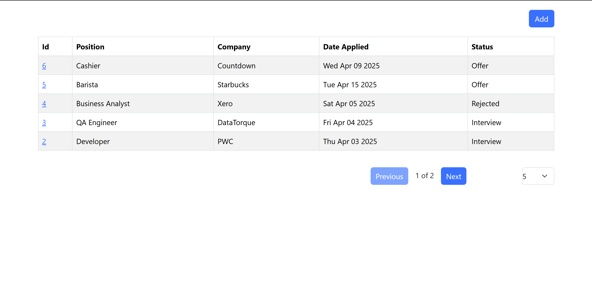
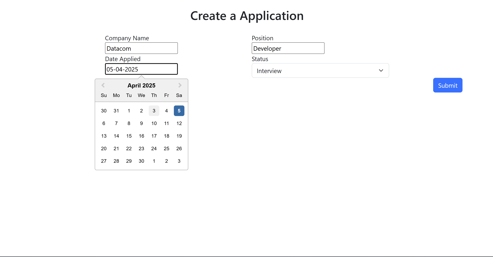
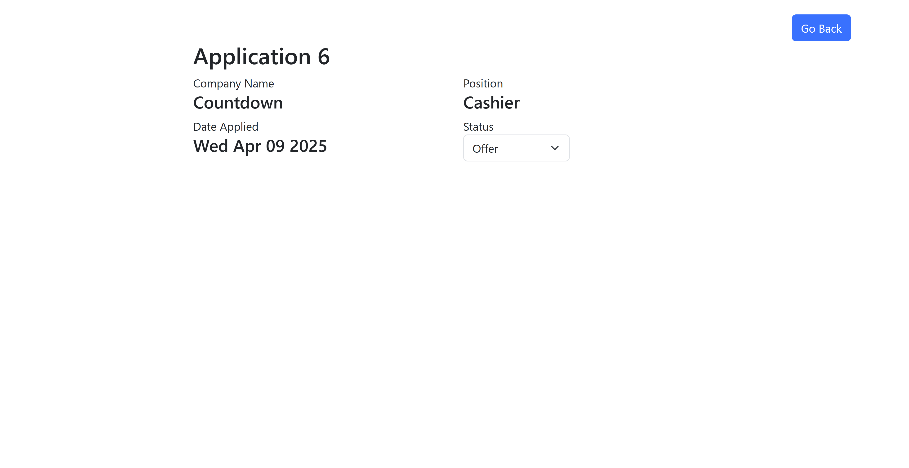
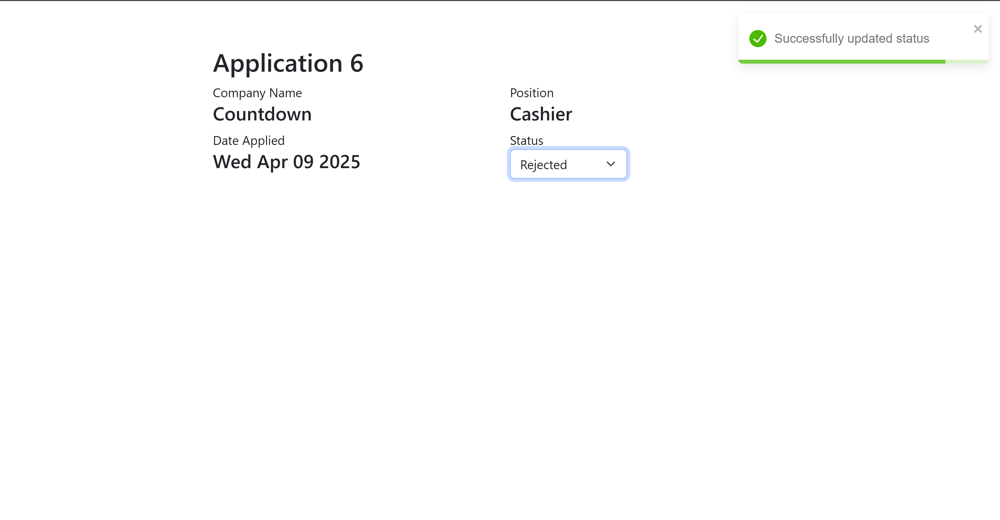

# JobApplicationTracker

Application made with react front end and .net backend. Chose not to use react redux as application wasnt large enough to consider. 
First time using react in long time as use vue/ blazor for my current job.

## How to run
Run following in the root folder:

### Backend
```
dotnet run --project .\JobApplicationTrackerSystemApi\src\JobApplicationTracker.Api\JobApplicationTracker.Api.csproj
```

### Frontend
```
cd .\JobApplicationTrackerWeb\job-application-tracking-app\
npm install
npm run start
```

Screenshots




